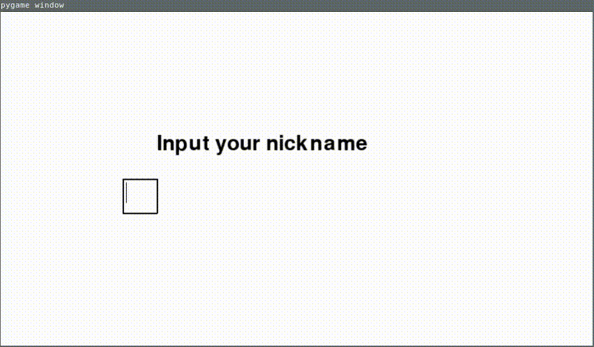

## What is this?
This is simple project to learn how to use own drawing in PyGame.
Hero was drawn in Krita by graphic tablet.
Below is gif with small demos of this project.




## How to run

```

pipenv install
pipenv run app

```
## To develop

```
pre-commit install
```

Background music come from `http://dig.ccmixter.org/games`

Sounds come from `https://freesound.org/`
