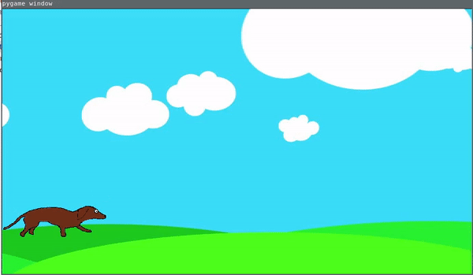

## What is this?
This is simple project to learn how to use own drawing in PyGame.
Hero was drawn in Krita by graphic tablet.
Below is gif represent this project.




## How to run

```

virtualenv venv3 -ppython3.8
source venv3/bin/activate
pip3 install -r requirements.txt
python run.py
```

on windows

```
.\venv\Scripts\activate


