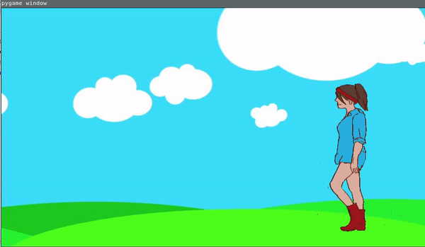

## What is this?
This is simple project to learn how to use own drawing in PyGame.
Hero was drawn in Krita by graphic tablet.
Below is gif represent this project.



## How to run

```

virtualenv venv3 -ppython3
source venv3/bin/activate
pip3 install -r requirements.txt

```


