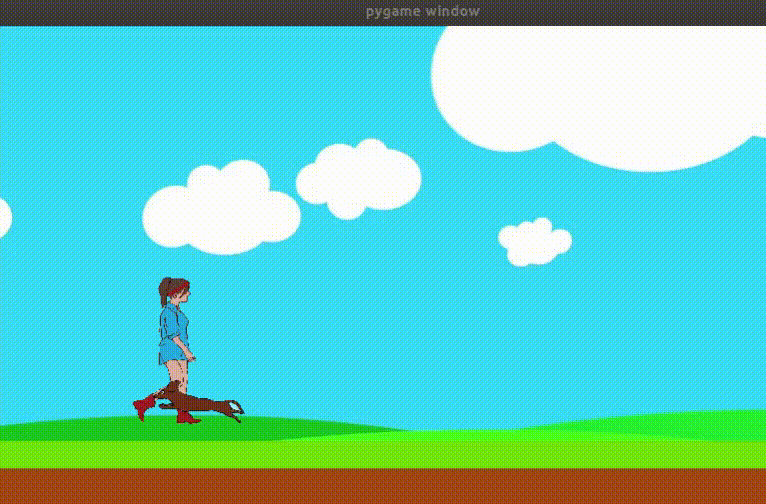

## What is this?
This is simple project to learn how to use own drawing in PyGame.
Hero was drawn in Krita by graphic tablet.
Below is gif represent this project.




## How to run

```

pipenv install
pipenv run app

```
## To develop

```
pre-commit install
```
